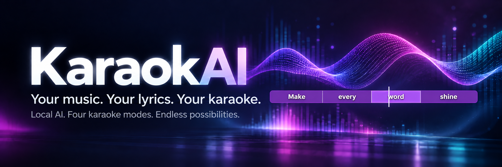
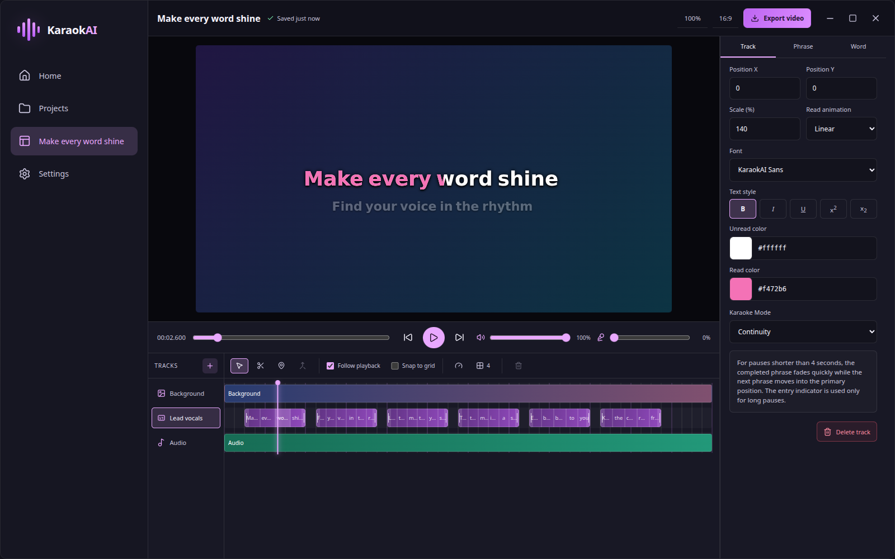
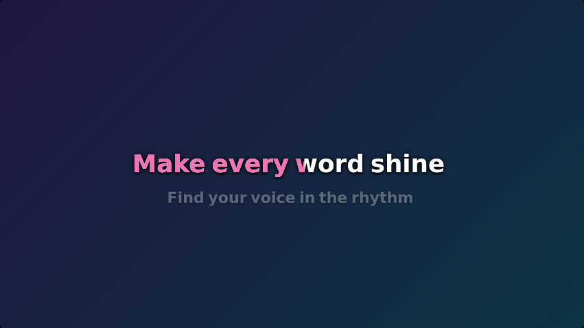
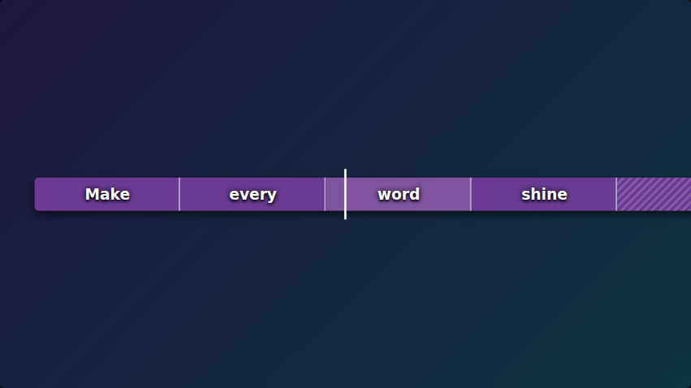
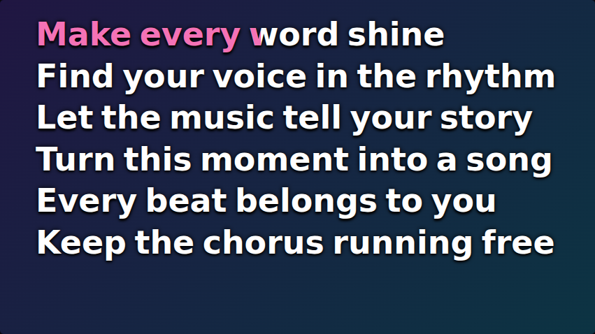
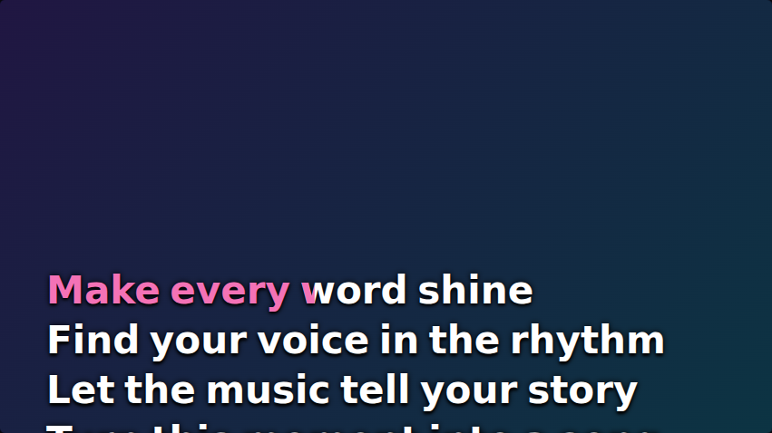

<div align="center">

# KaraokAI

### Your music. Your lyrics. Your karaoke.

Turn a song into a karaoke video — with local AI, precise lyric timing, and four ways to bring the words to life.

**Free & open source · Local processing · Windows & Linux**

[**Download KaraokAI**](https://github.com/TramontaG/Karaokai/releases/latest) · [See the modes](#four-modes-one-song) · [What's new](CHANGELOG.md) · [Build from source](#development)

</div>



<p align="center"><em>From the first word to the final chorus: shape the timing, style the lyrics, and see your video come together.</em></p>

## Make every word shine

KaraokAI gives you an editable starting point and the tools to make it your own. Separate vocals from the instrumental, generate lyrics with word-level timestamps, then fine-tune the result in a visual editor.

| Start with a song                                                                               | Make it yours                                                                       | Share the result                                                              |
| ----------------------------------------------------------------------------------------------- | ----------------------------------------------------------------------------------- | ----------------------------------------------------------------------------- |
| Import local audio or a YouTube video. Run vocal separation and transcription on your computer. | Adjust words and pauses, choose a karaoke mode, and style your text and background. | Export a karaoke video with instrumental, vocals, or a mix — at 30 or 60 FPS. |

**Your projects stay on your computer.** No account, telemetry, or mandatory song upload. Runtime and model downloads happen during setup; YouTube imports use the network. [Read the privacy policy →](PRIVACY.md)

## Four modes, one song

Choose the presentation that fits your video. Switch modes without rebuilding your lyrics or changing the timeline. The editor preview and video export share the same mode renderers.

<table>
  <tr>
    <td width="50%">
      <h3>Continuity</h3>
      
      <p>Keep the focus on the current line. Word-by-word highlighting, a preview of the next phrase, and anticipation cues help the singer follow along.</p>
    </td>
    <td width="50%">
      <h3>Banner</h3>
      
      <p>Bring the timeline into the video. Timed word rectangles travel past a playhead, with visible pauses, configurable speed, colors, and transparency.</p>
    </td>
  </tr>
  <tr>
    <td width="50%">
      <h3>Book</h3>
      
      <p>Read a page of lyrics at a glance. Lines stay in place, completed phrases make room for new ones, and pages appear together after long pauses.</p>
    </td>
    <td width="50%">
      <h3>Teleprompter</h3>
      
      <p>Let the lyrics flow. Continuous scrolling changes speed smoothly to meet each phrase on time, with a reading anchor you can position yourself.</p>
    </td>
  </tr>
</table>

<sub>Captured from KaraokAI 1.2.0 using an original demonstration project. Images show actual editor previews.</sub>

## A little automation. A lot of control.

- **Get a head start with local AI.** Demucs separates vocals and instrumental audio; transcription produces editable lyrics with word-level timing.
- **Find the right lyrics.** With a valid AcoustID application key, KaraokAI identifies imported audio and lets you confirm the artist and song before checking LRCLIB for synchronized lyrics. Confirmed lines guide WhisperX word timing; you can supply your own lyrics instead.
- **Tune every syllable.** Edit phrases, words, and pauses. Split phrases, drag timing boundaries, move phrases between tracks, and undo or redo your changes.
- **Work to the beat.** Use the metronome, BPM and time-signature changes, timeline zoom, snapping, and playback following.
- **Build your own look.** Set fonts, colors, scale, position, and reading curves at track, phrase, or word level. Import your own fonts.
- **Set the scene.** Use video, images, album art, solid colors, or gradients as backgrounds, with cover and contain options.
- **Choose your mix.** Export at 480p–1440p, with 30/60 FPS, H.264 presets, and instrumental, vocals, or mixed audio.
- **Keep your work organized.** Browse projects in a grid or list, duplicate versions, and reopen everything from your local library.

## Start your next karaoke video

1. **[Download the latest release](https://github.com/TramontaG/Karaokai/releases/latest)** for your platform.
2. **Choose a data directory.** On first launch, KaraokAI guides you through installing the local runtime and models.
3. **Import your song.** Confirm the artist, title, and any lyrics found, then review and refine the word timing.
4. **Pick a mode and press play.** Adjust the timing and appearance, then export your video.

| Platform    | Download                                                                                   |
| ----------- | ------------------------------------------------------------------------------------------ |
| Windows x64 | [NSIS installer (.exe)](https://github.com/TramontaG/Karaokai/releases/latest)             |
| Linux x64   | [AppImage or Debian package (.deb)](https://github.com/TramontaG/Karaokai/releases/latest) |

Each release includes `checksums.txt` for download verification. Windows installers are currently unsigned; signing is being set up through SignPath Foundation. macOS is not currently distributed as a signed, notarized release.

**Already using KaraokAI?** [Version 1.2.0](https://github.com/TramontaG/Karaokai/releases/tag/v1.2.0) adds Banner, Book, and Teleprompter. See the [full changelog](CHANGELOG.md).

## Local by design

The desktop bundle does not include the large AI models or processing binaries. The Runtime Manager installs them in your selected data directory, using a private Python installation without changing your system Python, `PATH`, or Windows Registry.

Models, runtime components, and cache can be inspected, removed, or reinstalled from Settings. Once the required components are installed, local audio processing does not need a song upload.

[How runtime installation works →](docs/runtime-installation.md)

## Development

Built with **Electron, React, TypeScript, and Vite**, with a Python processing worker and FFmpeg for media output.

Requires **Node.js 22** and **npm**.

```bash
git clone https://github.com/TramontaG/Karaokai.git
cd Karaokai
npm install
npm run dev
```

`npm run dev` starts Vite and the Electron application.

<details>
<summary><strong>Development commands and project structure</strong></summary>

| Command                       | Purpose                                           |
| ----------------------------- | ------------------------------------------------- |
| `npm run dev:web`             | Start only the Vite frontend                      |
| `npm run build`               | Type-check and build the application              |
| `npm test`                    | Run automated tests                               |
| `npm run test:render`         | Build and validate encoded video frames           |
| `npm run build:desktop`       | Package desktop targets for the current platform  |
| `npm run build:windows`       | Build the Windows x64 NSIS installer              |
| `npm run build:windows:store` | Build the Microsoft Store AppX package on Windows |
| `npm run format`              | Format the repository                             |
| `npm run format:check`        | Check formatting                                  |

Packaging artifacts are written to `release/`. Store distribution requires a Partner Center account and the reserved application identity in `electron-builder.yml`.

```text
src/                  React UI, editor, and rendering
electron/            Desktop process, IPC, and runtime management
worker/              Python separation and transcription worker
docs/                Technical documentation and screenshots
src-tauri/           Previous desktop implementation
```

</details>

## Explore, contribute, or report an issue

Found a timing edge case? Have an idea for another karaoke mode? [Open an issue](https://github.com/TramontaG/Karaokai/issues) with the steps to reproduce it or the workflow you would like to improve. Pull requests are welcome.

- [Karaoke modes and renderer architecture](docs/karaoke-modes.md)
- [Runtime installation](docs/runtime-installation.md)
- [Release process](docs/release-process.md)
- [Changelog](CHANGELOG.md)

## Code signing policy

Free code signing provided by SignPath.io, certificate by SignPath Foundation.

### Team roles

- Author, committer, reviewer, and approver: [Guilherme Tramontano
  (@TramontaG)](https://github.com/TramontaG)

Changes proposed by non-committers are reviewed before being merged. Each code
signing request is manually approved by the approver before signing.

### Security controls

The project maintainer uses multi-factor authentication for GitHub and
SignPath access. Release artifacts are built from tagged source code by the
repository's GitHub Actions workflow. The unsigned build artifact is retained
by GitHub Actions before it is submitted to SignPath. Once the SignPath
integration is enabled, only the signed artifact returned by SignPath will be
published as a signed Windows release.

### Privacy

KaraokAI does not include telemetry, advertising, analytics, user accounts, or
a KaraokAI-operated cloud service. Network requests occur only when explicitly
initiated by the user, including runtime/model downloads and YouTube imports.
See [PRIVACY.md](PRIVACY.md) for details.

## License and third-party software

KaraokAI is free software under the [GNU General Public License v3.0 or later](LICENSE). Third-party components keep their own licenses; see [THIRD_PARTY_NOTICES.md](THIRD_PARTY_NOTICES.md).

Please review [CONTENT_RIGHTS.md](CONTENT_RIGHTS.md) before importing or publishing media.

---

<p align="center"><strong>Make something worth singing along to.</strong><br><a href="https://github.com/TramontaG/Karaokai/releases/latest">Download KaraokAI</a> · <a href="https://github.com/TramontaG/Karaokai">Star the project</a></p>
